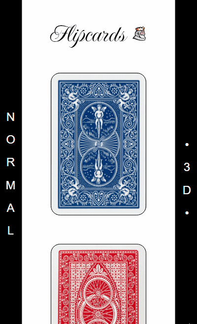

# Flying Queen - CSS 3D & Animation

Este projeto é um estudo prático e experimental focado na criação de flipcards em conjunto de animações 3d. O objetivo foi criar uma interface interativa com dois tipos de "flipcards": um com comportamento clássico e outro com uma animação avançada de voo e rotação.

## 📍 Live Demo
Veja o projeto no seu navegador:

<a href="https://dcastrodev.github.io/flying-queen/"><strong>🔗 Click to View</strong></a>

## Tecnologias utilizadas

* HTML5
* CSS3
    * Foco em `Perspective` e `Transform-style`
    * Animações baseadas em `@keyframes`
    * Flexbox para layout

## Conceitos Aplicados

O desenvolvimento deste site concentrou-se em dois pilares principais do CSS moderno:

### 1. Práticas de CSS 3D
Para criar o efeito de profundidade e rotação realista das cartas, foram aplicadas propriedades fundamentais do CSS 3D:
* **`perspective`**: Definida no elemento pai (`.wrapper-father`) para criar um ponto de fuga, dando a sensação de profundidade ao observador.
* **`transform-style: preserve-3d`**: Utilizada para garantir que os elementos filhos (frente e verso da carta) coexistam no mesmo espaço tridimensional.
* **`backface-visibility: hidden`**: Essencial para esconder a face oposta da carta durante a rotação, permitindo que o verso se torne a frente de forma fluida.

### 2. Animations (Efeito "Flying Card")
Diferente de um flip simples, o segundo card utiliza uma animação customizada chamada `voando`:
* **`@keyframes`**: Foram mapeados diferentes estágios (0% a 100%) para controlar `rotateY`, `scale` e `translate`.
* **Interatividade**: A animação é disparada no `hover`, onde a carta executa múltiplas voltas no ar (`rotateY`), diminui de tamanho para simular distância e depois retorna à sua posição original perfeitamente encaixada.

## ⚙ Funcionalidades

- **Normal Flipcard**: Uma transição suave de 180 graus no eixo Y, demonstrando o uso básico de `rotate` e `transition`.
- **Flying Flipcard**: Uma animação complexa que combina rotação, deslocamento espacial e redimensionamento, simulando uma carta voando em direção ao usuário.
- **Design Responsivo**: Layout se adapta para pc e mobile.

## Layout Preview

### PC

 

### Mobile

